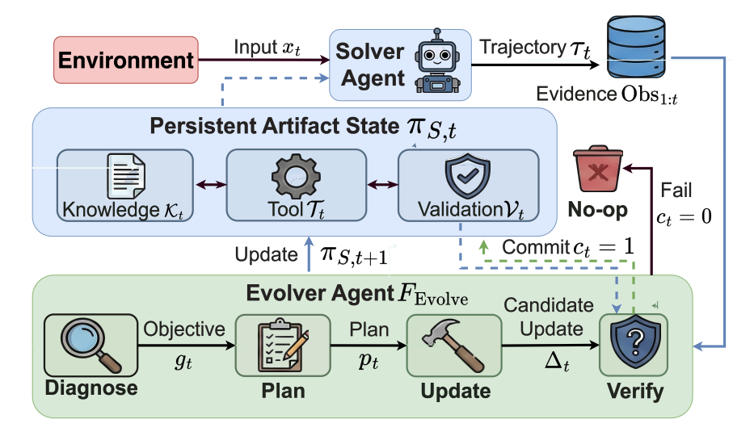

# A-Evo Lab (Agentic Evolution Laboratory) 🧬

Welcome to **A-Evo Lab**, a research initiative dedicated to the frontier of **Self-Evolving Agents** and **Continual Learning**. Led by [Henry Lu](https://x.com/HenryL_AI), we aim to bridge the gap between static LLM capabilities and autonomous, adaptive intelligence.

---

### 🚀 Our Vision
We believe the next leap in AI won't just come from larger pre-training, but from the ability of agents to **evolve through interaction, feedback, and self-correction.**

### 🛠 Active Research & Projects
* **A-EVOLVE Visualizer**: A real-time dashboard for tracking agentic evolution traces and error analysis. [ [Live Demo](#) ]
* **A-EVOLVE Framework**: Our core engine for agentic self-improvement in production environments. 

### 📢 News
* **[2026.01]** Our position paper for Agentic Evolution: [https://arxiv.org/abs/2602.00359].

---
[LinkedIn](https://www.linkedin.com/in/hanqing-lu/) | [Twitter/X](https://x.com/HenryL_AI) 
