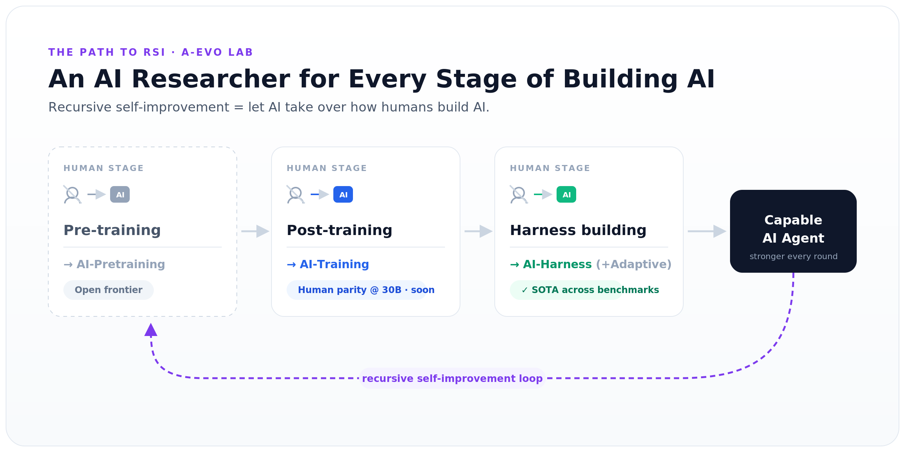
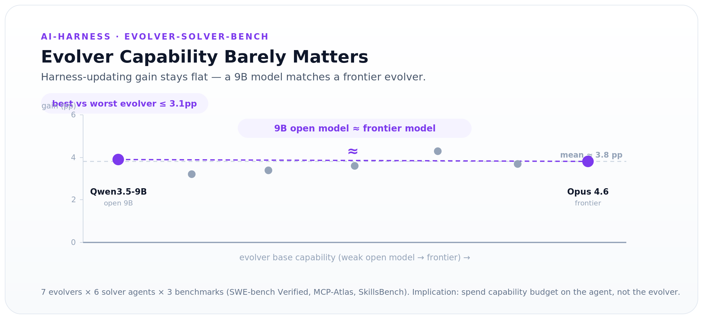
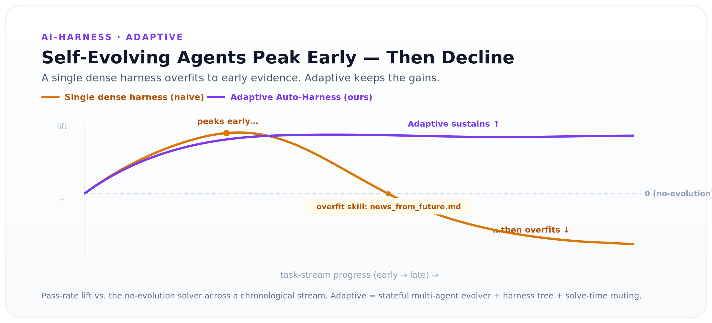
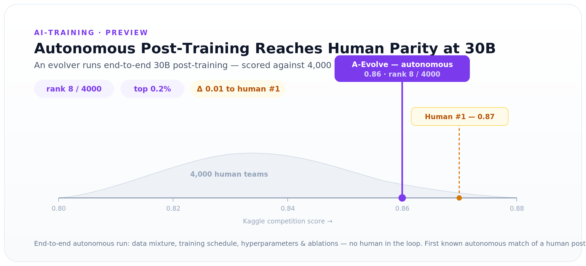

# A-Evo Lab (Agentic Evolution Laboratory) 🧬

<p align="center">
  
</p>

> **The path to recursive self-improvement (RSI) is to let AI take over how humans build AI.**

A-Evo Lab, led by [Henry Lu](https://x.com/HenryL_AI), studies **self-evolving agents** under one thesis — **AI-as-researcher**: frontier agents and models play the *researcher* in the loop that builds better AI. Today humans build AI in three critical stages — **pre-training → post-training → harness building**. We are building an autonomous AI researcher for each, have reached **SOTA results** where we've shipped, and develop everything on **one shared stack, [A-Evolve](https://github.com/A-EVO-Lab/a-evolve)**, so we can iterate fast.

---

## 🗺 The Map

| Human stage of building AI | Our program | What the AI researcher does | Status |
| :--- | :--- | :--- | :--- |
| Harness building | **AI-Harness** | Evolves prompts / skills / memory / tools around a frozen model | ✅ SOTA across benchmarks |
| ↳ long-running deployment | **AI-Harness · Adaptive** | Sustains performance on open-ended task streams | ✅ Leads every reported stream metric |
| Post-training | **AI-Training** | Designs data mixtures, schedules, HPs & ablations end-to-end | 🔜 Human-team parity @ 30B — *report in prep* |
| Pre-training | **AI-Pretraining** | — | 🧭 The open frontier |

---

## 🛠 AI-Harness — replacing human harness engineering

With **zero manual harness engineering**, A-Evolve's reference algorithms push a single Claude Opus-4.6 base model to top-tier performance across diverse agentic benchmarks:

<table>
<tr>
<td align="center" width="23%">
<h3>🟢 MCP-Atlas</h3>

<br/><br/>
<strong>🥇 #1</strong><br/>
<sub>Baseline → <strong>79.4%</strong> (+3.4pp)</sub>
</td>
<td align="center" width="23%">
<h3>🔵 SWE-bench Verified</h3>

<br/><br/>
<strong>~#5</strong><br/>
<sub>Baseline → <strong>76.8%</strong> (+2.6pp)</sub>
</td>
<td align="center" width="23%">
<h3>🟣 Terminal-Bench 2.0</h3>

<br/><br/>
<strong>~#7</strong><br/>
<sub>Baseline → <strong>76.5%</strong> (+13.0pp)</sub>
</td>
<td align="center" width="23%">
<h3>🟡 SkillsBench</h3>

<br/><br/>
<strong>#2</strong><br/>
<sub>Baseline → <strong>34.9%</strong> (+15.2pp)</sub>
</td>
</tr>
<tr>
<td align="center" width="23%">
<h3>🟢 ARC-AGI</h3>

<br/><br/>
<strong>🥇 #2 Community Leaderboard</strong><br/>
<sub>Baseline → <strong>12.3%</strong> (+2.2pp)</sub>
</td>
<td align="center" width="23%">
<h3>🔵 OSWorld</h3>

<br/><br/>
<strong>—</strong><br/>
<sub>Baseline → <strong>69.6%</strong> (+3.9pp)</sub>
</td>
<td align="center" width="23%">
<h3>🟣 SWE-bench Lite</h3>

<br/><br/>
<strong>Evolved</strong><br/>
<sub>63.7 → <strong>67.0%</strong> (+3.3pp)</sub>
</td>
<td align="center" width="23%">
<h3>🟡 τ-bench</h3>

<br/><br/>
<strong>Evolved</strong><br/>
<sub>72.7 → <strong>77.0%</strong> (+4.3pp)</sub>
</td>
</tr>
<tr>
<td align="center" width="23%">
<h3>🟢 CL-Bench</h3>

<br/><br/>
<strong>Evolved</strong><br/>
<sub>29.5 → <strong>34.0%</strong> (+4.5pp)</sub>
</td>
<td align="center" width="23%">
<h3>🔵 WebArena-Infinity</h3>

<br/><br/>
<strong>Evolved</strong><br/>
<sub>72.5 → <strong>76.3%</strong> (+3.8pp)</sub>
</td>
</tr>
</table>

> *Single Claude Opus-4.6 base model, evolved with A-Evolve's reference algorithms. 0 hours of human harness engineering. CL-Bench, SWE-bench Lite, τ-bench & WebArena-Infinity show before → after on the same base model. Data checked March 2026.*

**Key finding — evolver capability decouples from harness quality.** A 9B model (Qwen3.5) writes harness updates as good as Claude Opus 4.6 (best-vs-worst evolver ≤ 3.1pp); benefit is *non-monotonic* — mid-tier agents gain most, weak agents fail to even load the harness. **Implication: put your capability budget on the agent, not the evolver.**

<p align="center"></p>

📄 **Evolver-Solver-Bench** — *Harness Updating Is Not Harness Benefit.* [arXiv 2605.30621](https://arxiv.org/abs/2605.30621) · [HF Daily](https://huggingface.co/papers/2605.30621)
📄 **Evo-Harness** — *Context-to-Harness Skill Compilation* (online evolution: feedback grounding, abstraction level, solver–evolver alignment). *Releasing soon.*

### ↳ Adaptive — sustaining agents on long-running streams

Naive self-evolving agents **peak early and then decline** — a single dense harness overfits to early evidence. **Adaptive Auto-Harness** fixes this with a stateful multi-agent evolver, a harness tree with solve-time routing, and scoped human-steering hooks — leading every reported metric against five auto-harness baselines plus the human-designed OctoTools:

| Stream | Domain | A-Evolve-Adaptive | Next best |
| :--- | :--- | :--- | :--- |
| **PolyBench** | Prediction markets | **80.9%** Accuracy | 50.8% |
| **CTF-Dojo** | Security competitions | **50.2%** Pass | 45.2% |
| **FutureX** | Event forecasting | **49.5%** Pass | 47.5% |

<p align="center"></p>

📄 **Adaptive Auto-Harness** — *Sustained Self-Improvement on Open-Ended Task Streams.* *Releasing soon.*

---

## 🧪 AI-Training — replacing human post-training

The same loop, carried all the way into **model weights**: an evolver autonomously runs **end-to-end 30B post-training** — designing data mixtures, training schedules, hyperparameter regimes, and ablation protocols — reaching **parity with a human post-training team**. To our knowledge, the first time an autonomous system has done so at this scale.

**Tech report in preparation** — full results and methodology on release.

<!-- Figure ready (figs/fig_30b_parity.png) — hold until the tech report is public, then uncomment: -->
<!-- <p align="center"></p> -->

---

## 🧭 AI-Pretraining — the open frontier

The largest and most expensive stage of building AI — and the one we have **not** automated yet. It is where this thesis goes next.

---

## ⚙️ One Shared Stack: A-Evolve

Every result above was developed on **[A-Evolve](https://github.com/A-EVO-Lab/a-evolve)**, our open-source infrastructure for self-improving agents — *"the PyTorch for Agentic AI."* It evolves **any** agent, in **any** domain, with **any** evolution algorithm, and is what makes fast iteration across all three programs possible.

```python
import agent_evolve as ae

evolver = ae.Evolver(agent="./my_agent", benchmark="swe-verified")
results = evolver.run(cycles=10)        # SOTA agent. 3 lines. 0 hours of manual harness engineering.
```

**Adopted & integrated by:** OpenRLHF · DeepSpeed · SGLang · GEPA · AutoResearch

⭐ Star the repo → [github.com/A-EVO-Lab/a-evolve](https://github.com/A-EVO-Lab/a-evolve)

<p align="center"></p>

---

## 📫 Contact

**Building in this direction, or want to collaborate?** Reach out — [X / Twitter](https://x.com/HenryL_AI) · [LinkedIn](https://www.linkedin.com/in/hanqing-lu/).

---

## 📢 News
- **5/30** **New Paper** — [*Harness Updating Is Not Harness Benefit*](https://arxiv.org/abs/2605.30621) (arXiv 2605.30621). 7 evolver models × 6 solver agents × 3 benchmarks: counterintuitive answers on *who* produces good harness updates and *who* benefits.
- **05/04** **New Benchmark Results** — A-Evolve [results](https://x.com/HenryL_AI/status/2051711038618480816?s=20) on [ARC-AGI-3](https://arcprize.org/arc-agi/3), evolving a multi-agent system from 10% → 12%.
- **04/20** **New Algorithm** — [GEPA](https://x.com/HenryL_AI/status/2046326722912739713?s=20), submitted by the [GEPA](https://gepa-ai.github.io/gepa/blog/) team.
- **04/10** **Integration** — into [Orch-Research Skills Library](https://x.com/HenryL_AI/status/2042688465855488476), alongside AutoResearch, OpenRLHF, DeepSpeed, SGLang.
- **04/07** **New Agent** — transplanted our Terminal-Bench 2.0 harness onto ClawCode: [67.8% → 72.9%](https://x.com/HenryL_AI/status/2041621538580132280) (+5.1pp).
- **04/03** **New Algorithm** — [Meta-Harness](https://x.com/HenryL_AI/status/2040218374458974715).
- **03/25** 🚀 **Open-sourced A-Evolve** + 4 reference algorithms achieving SOTA (#1, ~#5, ~#7, #2) on MCP-Atlas, SWE-bench Verified, Terminal-Bench 2.0, SkillsBench.
- **02/17** 📄 Position paper: [*Agentic Evolution is the Path to Evolving LLMs*](https://arxiv.org/abs/2602.00359) (arXiv 2602.00359).

---

We are evolving fast — support our research by leaving a ⭐ on [A-Evolve](https://github.com/A-EVO-Lab/a-evolve).

[LinkedIn](https://www.linkedin.com/in/hanqing-lu/) | [Twitter/X](https://x.com/HenryL_AI)
