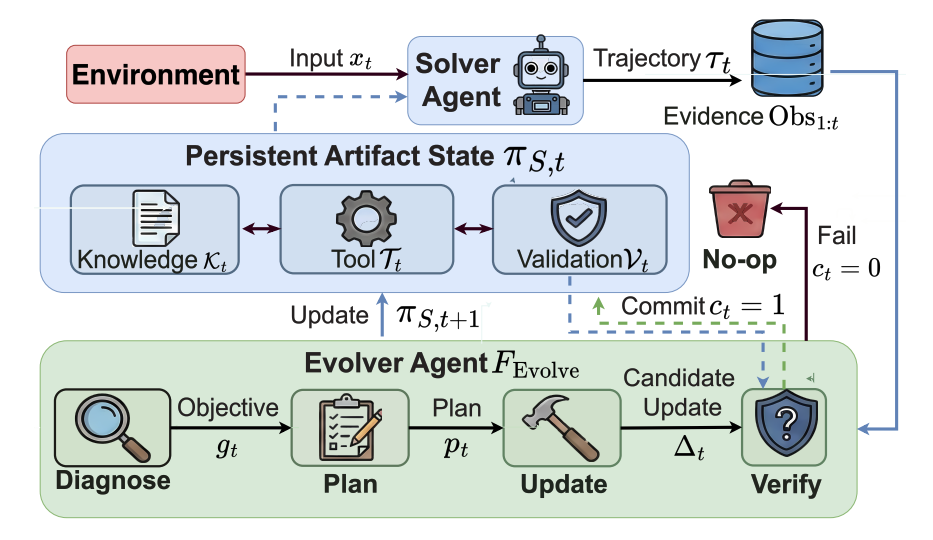

# A-Evo Lab (Agentic Evolution Laboratory) 🧬

Welcome to **A-Evo Lab**, a research initiative dedicated to the frontier of **Self-Evolving Agents** and **Continual Learning**. Led by [Henry Lu](https://x.com/HenryL_AI), we aim to bridge the gap between static LLM capabilities and autonomous, adaptive intelligence.

---

### 🚀 Our Vision
We believe the next leap in AI won't just come from larger pre-training, but from the ability of agents to **evolve through interaction, feedback, and self-correction.**

### 🛠 Active Research & Projects
* **A-EVOLVE Visualizer**: A real-time dashboard for tracking agentic evolution traces and error analysis. [ [Live Demo](#) ]
* **A-EVOLVE Framework**: Our core engine for agentic self-improvement in production environments. 

### Benchmark Highlights

By applying our open-source **reference evolution algorithms** to a base Claude Opus-4.6 model with **zero manual harness engineering**, A-Evolve pushed agents into top-tier performance across four diverse benchmarks:

<table>
<tr>
<td align="center" width="23%">
<h3>🟢 MCP-Atlas</h3>

  
<strong>🥇 #1</strong> 
Baseline → <strong>79.4%</strong> (+3.4pp)
</td>
<td align="center" width="23%">
<h3>🔵 SWE-bench Verified</h3>

  
<strong>~#5</strong> 
Baseline → <strong>76.8%</strong> (+2.6pp)
</td>
<td align="center" width="23%">
<h3>🟣 Terminal-Bench 2.0</h3>

  
<strong>~#7</strong> 
Baseline → <strong>76.5%</strong> (+13.0pp)
</td>
<td align="center" width="23%">
<h3>🟡 SkillsBench</h3>

  
<strong>#2</strong> 
Baseline → <strong>34.9%</strong> (+15.2pp)
</td>
</tr>
  <tr>
<td align="center" width="23%">
<h3>🟢 ARC-AGI </h3>

  
<strong>🥇 #2 Community LeaderBoard </strong> 
Baseline → <strong>12.3% </strong> (+2.2pp)
</td>
<td align="center" width="23%">
<h3>🔵 OSWorld </h3>

  
<strong> -- </strong> 
Baseline → <strong>69.6%</strong> (+3.9pp)
</td>
<td align="center" width="23%">
<h3>🟣 CL Bench </h3>

  
<strong> To Be Announced  </strong> 
To Be Announced  
</td>
<td align="center" width="23%">
<h3>🟡 WebArena-infinity </h3>

  
<strong> To Be Announced  </strong> 
To Be Announced 
</td>
</tr>
</table>

### 📢 News
- **04/10** **Integration**, A-Evolve is officially integrated into [Orch-Research Skills Library](https://x.com/HenryL_AI/status/2042688465855488476), along with others including AutoResearch, OpenRLHF, DeepSpeed, SGLang
- **04/07** **New Agent Drop**, We added recently leaked public ClawCode (Claude Code), took the evolution harness + skills we learned on Terminal-Bench 2.0 (TB2) and directly transplanted them onto the ClawCode. [Result](https://x.com/HenryL_AI/status/2041621538580132280) on TB2: baseline **67.8%** → **72.9%** (+5.1pp uplift)
- **04/03** **New Algorithm Drop**, A-Evolve added new evolutionary algorithm [Meta-Harness](https://x.com/HenryL_AI/status/2040218374458974715)
- **03/30** **Integration**, A-Evolve is officially integrated into [AutoResearchClaw](https://github.com/aiming-lab/AutoResearchClaw) 
- **03/25** 🚀 **Open-source A-Evolve**, the universal infrastructure for developing and testing evolving algorithms.
- **03/25** 📊 **Open-source 4 evolving algorithms** developed with A-Evolve, achieving SOTA **(#1, ~#5, ~#7, #2)** on MCP-Atlas, SWE-bench Verified, Terminal-Bench 2.0, and SkillsBench.
- **02/17** 📄 Release the official implementation of [*Position: Agentic Evolution is the Path to Evolving LLMs*](https://arxiv.org/abs/2602.00359) (arXiv 2602.00359).
* **[2026.01]** Our position paper for Agentic Evolution: [https://arxiv.org/abs/2602.00359].

---
[LinkedIn](https://www.linkedin.com/in/hanqing-lu/) | [Twitter/X](https://x.com/HenryL_AI) 
